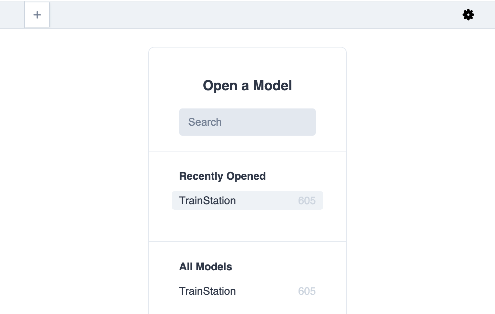
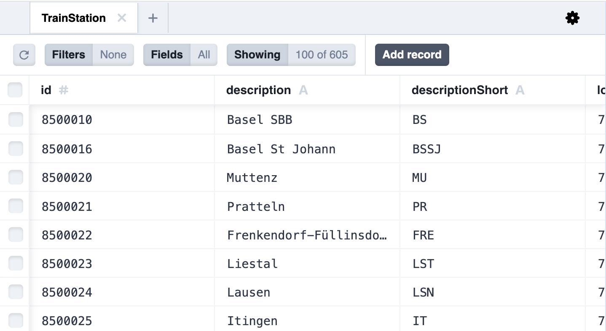
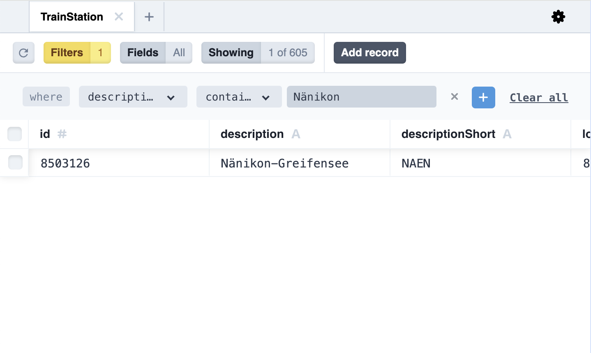

# TDV Backend

## TypeDI
We use the library TypeDI to get Dependency Injection features. 
Services can be registered with a `@Service` annotation:
```
@Service()
export class DataAccessClient { }
```
And this service can be injected via `@Inject`:
```
class SomeClass {
    @Inject()
    dataAccess: DataAccessClient;
}
```
Or in another Service via the constructor (recommended):
```
export class ApiImportService {
    constructor(private readonly dataAccess: DataAccessClient) { }
}
```

## Prisma
We use prisma to apply database migrations. 
This allows us to always be on the same state of the database. 
Prisma offers a TypeScript client so that we can run databse operations directly from code.

For that we have a `DataAccessClient` class which can be injected via TypeDI:
```
constructor(private readonly dataAccess: DataAccessClient) { }
```
In the code, this can now be used as:
```
this.dataAccess.client.trainStation.findMany().then(x => logger.info(x.length));
```
The pattern for database operations is: 
```
this.dataAccess.client.<table-name>.action(<parameters>)
```
The operations are generated by prisma based on the model defined in `schema.prisma`.

### Database Inspection
To view the tables and data in the database, launch `npm run prisma-studio` which opens a UI at `http://localhost:5555`.
In the first view you can see all tables along with how many entries are present in that table:

If you click on a table you can see all entries in that table:

In the top bar you can also filter for entries:


### How to start
1. Open project root in a dev container at `/workspace`. This also launches a postgres database.
2. copy `.devcontainer/devcontainer.env` to `backend/.env`
3. run `cd backend`
4. run `npm install`
5. run `npm run prisma-deploy`
6. run `npm run prisma-generate`
7. start with `npm start`

### How to apply migrations
1. Change the `schema.prisma` file according to the documentation linked in the file
2. run `cd backend`
3. run `npm run prisma-migrate` to apply the migration
4. run `npm run prisma-generate` to update the TypeScript client